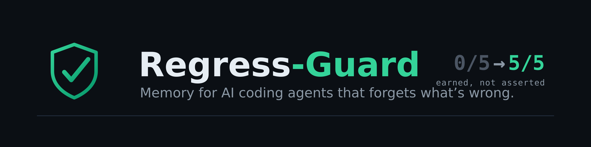
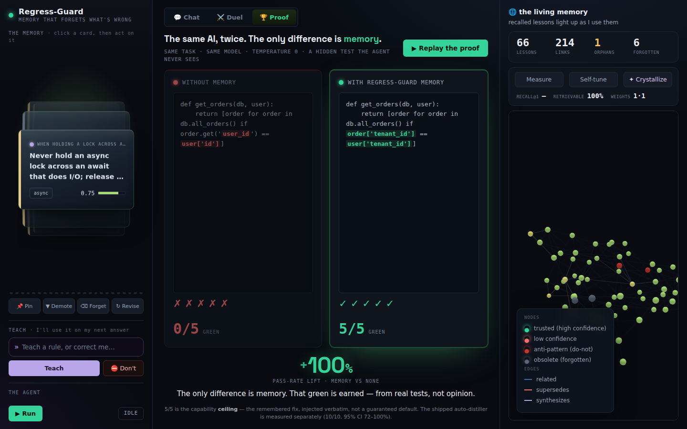
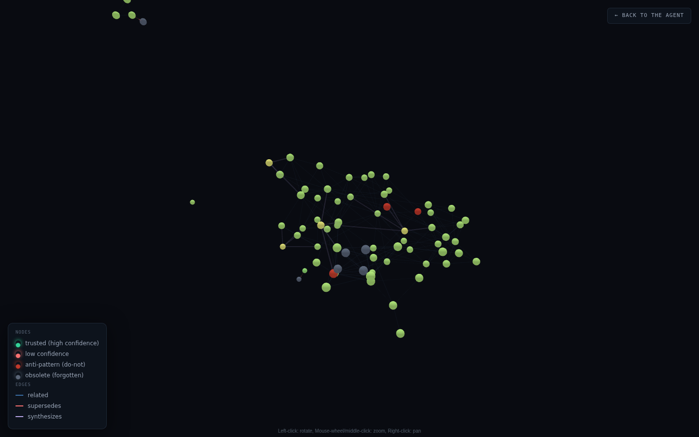
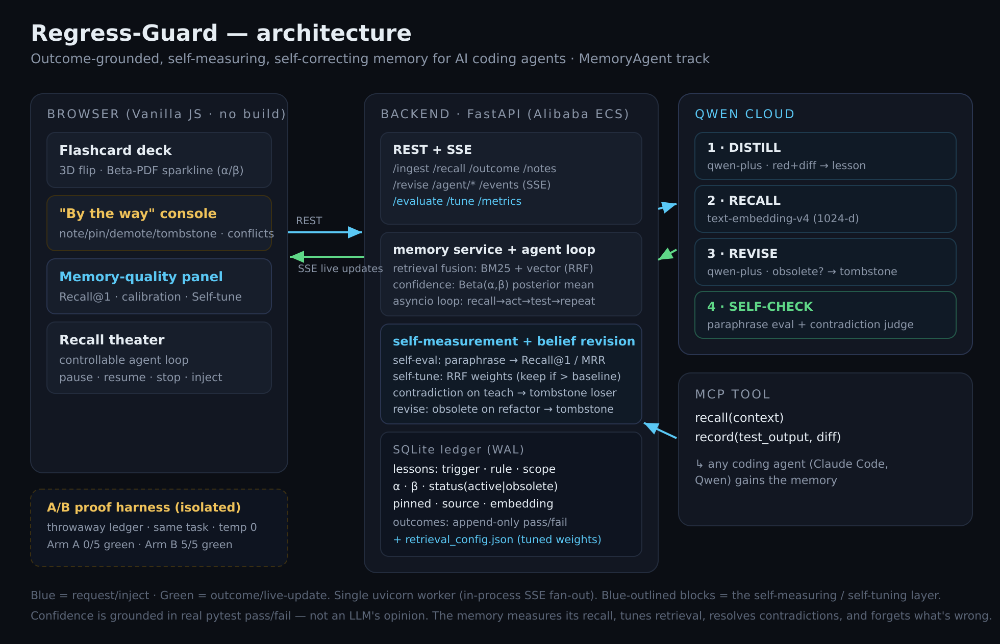

<p align="center">
  
</p>

<h1 align="center">Regress-Guard</h1>

<p align="center">
  <b>A memory that stops AI coding agents from re-introducing bugs they already fixed —<br>
  with confidence <i>earned from real test outcomes</i>, not the model's opinion.</b>
</p>

<p align="center">
  <a href="http://regressguard.duckdns.org"></a>
  
  
</p>

<p align="center">
  
  
  
  
  
  
  
</p>

---

## The problem

AI coding agents are **stateless across sessions**: you fix a bug today, and a fresh session tomorrow
happily reintroduces it. Existing "memory" features remember *facts you tell them* — they can't tell
whether a remembered rule actually **works**. Regress-Guard is a memory whose trust is **earned by real
evidence**, and that **forgets advice a refactor made wrong**.

---

## The proof — same AI twice, the only difference is memory

<p align="center"></p>

`harness/ab_runner.py` runs the **same** coding task, **same** model (`qwen-plus`, temperature 0),
against a **hidden** `pytest` the agent never sees. The task never states our tenant convention, so
the knowledge *must* come from memory. Three honest measurements, not one number:

```text
  A/B RESULT — get_orders tenant isolation   (model=qwen-plus, temp=0)
  Floor    (no memory)                       : 0/5 GREEN  →  invents order['user_id'] == user['id']   ✗
  Ceiling  (remembered developer fix, verbatim): 5/5 GREEN  →  scopes  order['tenant_id'] == user['tenant_id']  ✓
  Distillation reliability (shipped auto-distiller): 10/10 pass, Wilson95 [72,100]%
```

> **Honest framing** (survived an adversarial self-review): the **ceiling** (5/5) is the *capability
> ceiling* of memory injection — the remembered human fix replayed verbatim — **not** the shipped
> default. What we actually ship is an **auto-distiller** that turns the red test + fix into a lesson;
> measured separately, **10 of 10 independent distillations** produced a lesson that passed the hidden
> test (Wilson95 **[72,100]%**). The core contribution is **test-grounded self-correction**: a
> distillation that drops the concrete comparison **fails the hidden test and gets demoted**, so
> confidence tracks what actually works. The temp-0 in-run trials are a *consistency* check, not an
> independent sample — the independent unit is the distillation (one draw per run), which is why the
> Wilson interval lives there. We never claim "guaranteed 100%".
>
> **Generalisation across 3 bug classes** (`harness/generalization.py`): memory flips the two classes
> the base model gets **wrong** by default — *tenant isolation* and *pagination leak* — from **0/3 →
> 3/3** each. On *money rounding* Qwen already writes correct code unaided (floor **3/3**), so memory
> adds **no** lift and does **no** harm (ceiling 3/3). Two independent 0→100 flips kill the
> cherry-pick objection; the third shows the memory is harmless when it isn't needed. Auto-distiller
> **18/18** (Wilson95 82–100%) across all three. Reproduce it yourself:

```bash
python -m harness.ab_runner --k 5 --distill-samples 10 --verbose   # floor / ceiling / distillation
python -m harness.generalization --k 3 --distill-samples 6         # all 3 bug classes
```

---

## Verify it in 60 seconds

No install — hit the live deployment:

```bash
# 1) the captured causal proof (0/5 → 5/5)
curl -s http://regressguard.duckdns.org/ab | python -m json.tool

# 2) the memory as a graph (nodes = lessons, edges = related / supersedes / synthesizes)
curl -s http://regressguard.duckdns.org/graph | python -m json.tool | head -40

# 3) ask the agent — the answer is steered by recalled, outcome-grounded lessons
curl -s http://regressguard.duckdns.org/chat -H 'content-type: application/json' \
     -d '{"message":"How should I list orders for a user?"}'
```

Or just open **[regressguard.duckdns.org](http://regressguard.duckdns.org)** → the **🏆 Proof** tab.

---

## What you can see and steer

One clinical surface — **💬 Chat · 🌐 Graph · 🏆 Proof** — toggled in the same frame:

| | Feature | What it means |
|---|---|---|
| 💬 | **Chat + editable memory** | Talk to the agent; beside it, a flashcard deck shows every lesson with a **Beta(α,β) confidence meter** — **pin**, **demote** or **forget** any lesson in a click. |
| 🌐 | **3D knowledge globe** | The whole memory as a rotating globe (currently **58 nodes / 157 edges**): node size = evidence (α+β), colour = confidence, grey = forgotten, dark-red = anti-pattern; **synapse strength varies** as Hebbian co-recall strengthens edges. **Click a node and its strands light up by type** — *related* (blue), *supersedes* (red), *synthesizes* (violet) — so you see at a glance what a memory connects to. |
| 🏆 | **The proof** | The signature A/B moment above, replayable on demand — the decisive token pulses, the pass-rate lift counts up. |
| ⛔ | **Anti-pattern inhibitions** | Dead-end rules a past regression proved wrong are injected as active **⛔ DO NOT** directives — the agent is steered *away* from a known bad path, not just toward a good one. |
| ✦ | **Crystallization (ExpeL)** | A cluster of related lessons can be distilled into one higher-level meta-lesson that then **earns its own confidence** from real tests like any other. |
| 🧠 | **Associative memory (Hebbian + spreading activation)** | Neuroscience-*inspired*, not mystical: lessons recalled together **wire together** — the edge weight grows with co-recall (capped), never touching confidence (that stays test-earned). An opt-in **spreading-activation** recall then follows the strongest synapses to surface associated neighbours that pure search misses. |
| 🛡 | **Poison defense** | Recalled lessons enter the prompt as *untrusted data* behind structural markers + a deterministic sanitizer — a poisoned lesson can't become a command. |

<p align="center"></p>

---

## Qwen's four roles

| # | Role | Model | Where |
|---|------|-------|-------|
| 1 | **DISTILL** — red test + fix diff → lesson JSON | `qwen-plus` (JSON mode) | `backend/extractor.py` |
| 2 | **RECALL** — embed lessons + context, fuse with BM25 (RRF) | `text-embedding-v4` (1024-d) | `backend/retrieval.py`, `memory.py` |
| 3 | **REVISE** — is a lesson now obsolete? → tombstone | `qwen-plus` | `backend/reviser.py` |
| 4 | **SELF-CHECK** — keyword-free paraphrase eval + contradiction judge | `qwen-plus` | `backend/evaluation.py`, `reviser.py` |

*Even the coding agent in the proof harness is Qwen — Qwen both **causes** and **cures** the bug via memory.*

---

## The memory measures, tunes and corrects itself

Beyond learn → recall → grade, Regress-Guard improves its *own* retrieval and consistency:

- **Self-evaluation** — Qwen writes *keyword-free* paraphrase queries so BM25 can't win on word overlap; it measures **Recall@1 / MRR** with the vector leg on vs off. Retrieval quality graded on evidence, not vibes.
- **Self-tuning** — grid-searches the BM25 + vector fusion weights against measured Recall@1 and **persists new weights only if they beat baseline** (Recall@1 **0.75 → 1.00** in our runs).
- **Contradiction detection** — a new lesson is checked (vector-cosine shortlist → Qwen judge) against active ones; a genuine contradiction tombstones the loser, so the memory never holds two opposite rules.
- **Calibration** — a live panel shows Recall@1, the semantic lift, grounded-outcome count, and the **calibration gap** (displayed confidence vs empirical pass-rate, from *real* outcomes).
- **Associative recall** — lessons recalled together strengthen a Hebbian synapse (weight grows with co-recall, capped); an opt-in spreading-activation pass then walks the strongest synapses to surface associated neighbours pure search misses. This is *associative memory* (Hebbian wiring / spreading activation) — neuroscience-inspired, and it **never** touches a lesson's confidence, which stays earned from real test outcomes.

Every real **pytest pass/fail** updates a lesson's confidence as the posterior mean of a Beta distribution:

```math
\text{confidence} = \mathbb{E}[\text{Beta}(\alpha,\beta)] = \frac{\alpha}{\alpha+\beta}, \qquad \text{pass} \Rightarrow \alpha{+}1, \quad \text{fail} \Rightarrow \beta{+}1
```

---

## Architecture

<p align="center"></p>

Outcome-grounded confidence lives in a SQLite ledger (WAL, atomic in-SQL Beta updates); the browser is
fed live over Server-Sent Events; an MCP tool exposes the memory to any agent. Details:
[`architecture/ARCHITECTURE.md`](architecture/ARCHITECTURE.md).

---

## Run it

```bash
python3 -m venv .venv && source .venv/bin/activate
pip install -r requirements.txt
cp .env.example .env            # set DASHSCOPE_API_KEY + QWEN_BASE_URL (Qwen Cloud workspace host)

python -m backend.qwen_client          # connectivity test against Qwen
python -m harness.ab_runner --k 5 -v   # reproduce the A/B proof
uvicorn backend.main:app --workers 1   # then open http://localhost:8000
```

> **`--workers 1` is required** — the live-update fan-out (SSE) is in-process.
> Tests: `pytest` (offline, 53/53) · `pytest -m live` (hits Qwen).

---

## MCP integration — a real tool, not just a demo

`mcp_tool/server.py` exposes `recall(context)` and `record(test_output, diff)` over MCP. By default it
talks to the **deployed memory on Alibaba Cloud over HTTP** — so any coding agent (Claude Code, Qwen
Code, Cursor) gains a shared, outcome-grounded memory with **zero local setup** (no ledger, no API key;
the cloud does the distilling + retrieval). An agent calls `recall` before writing code and `record`
after fixing a red test, so the same bug can't come back in a later session.

**30-second setup + verified transcript:** [`mcp_tool/README.md`](mcp_tool/README.md) · config: [`.mcp.json`](.mcp.json)
(`REGRESS_GUARD_LOCAL=1` switches to a fully local ledger + your own Qwen key.)

---

## Deployment

Runs as a single process on **Alibaba Cloud ECS** (Singapore) — see [`deploy/README.md`](deploy/README.md).
Live: **[regressguard.duckdns.org](http://regressguard.duckdns.org)** (friendly URL, also works behind IP-blocking filters).

## Attribution & license

MIT (see [`LICENSE`](LICENSE)). The retrieval fusion (BM25 + Reciprocal Rank Fusion) is adapted from the
author's own MIT-licensed **markmem** engine; everything else — the ledger, the outcome-grounded Beta
confidence, the A/B harness, the Qwen wiring, the UI, the 3D globe, and the controllable agent loop — is
new for this hackathon.
