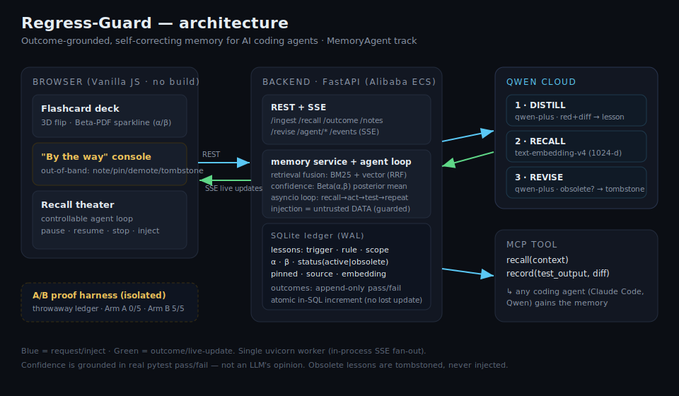

# Architecture

Regress-Guard is a small, single-process system: a FastAPI backend over a SQLite ledger, three
Qwen roles, a browser UI fed by Server-Sent Events, and an MCP tool that lets a real coding agent
use the memory. A separate, isolated harness holds the causal A/B proof.

## Components

- **Qwen Cloud (3 roles).** `backend/qwen_client.py` wraps Qwen in OpenAI-compatible mode.
  1. **DISTILL** (`extractor.py`) — `qwen-plus` in JSON mode turns a red test + fix diff into a
     lesson `{trigger, lesson, scope, severity}`.
  2. **RECALL** (`retrieval.py` + `memory.py`) — `text-embedding-v4` (1024-d) embeds lessons and the
     query; cosine is fused with BM25 via Reciprocal Rank Fusion (K=60). BM25+RRF is adapted from the
     author's MIT `markmem`.
  3. **REVISE** (`reviser.py`) — `qwen-plus` judges whether an active lesson is made obsolete by a
     described change and tombstones it.
  4. **SELF-CHECK** (`evaluation.py` + `reviser.py`) — `qwen-plus` writes keyword-free paraphrase
     queries so retrieval quality can be measured honestly, and judges whether a newly taught lesson
     *contradicts* an existing one (belief revision on teach). Same client, two more roles.

- **Self-measurement + self-tuning (`evaluation.py`).** The memory measures and improves *itself*:
  - `evaluate()` — for a sample of lessons, Qwen writes a paraphrased question that deliberately
    avoids the lesson's own keywords (so BM25 can't win on word overlap); we then measure **Recall@1/3
    and MRR** with the vector leg **on vs off** — proof the semantic retrieval earns its place.
  - `tune()` — grid-searches the RRF fusion weights against that measured Recall@1 and **persists the
    best weights only if they beat the neutral baseline** (`data/retrieval_config.json`, loaded by
    `memory.recall`). A memory that tunes how it retrieves, graded by its own hit-rate.
  - `metrics()` — a cheap, no-LLM health snapshot: grounded-outcome count, average confidence, and a
    **calibration gap** (predicted confidence vs empirical pass-rate).

- **Contradiction detection on teach (`reviser.check_contradiction`).** When a lesson is taught, a
  two-stage cheap→expensive check runs: vector cosine shortlists semantic neighbours, then `qwen-plus`
  judges a genuine contradiction; the loser is tombstoned (`superseded_by`). Newer teaching wins unless
  the established rule is clearly more correct. Wired into `memory.add_note`.

- **Ledger (`ledger.py`, SQLite + WAL).** `lessons` (trigger, rule, scope, severity, embedding BLOB,
  α, β, status, pinned, source, timestamps) + append-only `outcomes`. Confidence = posterior mean
  α/(α+β). Concurrency: `journal_mode=WAL` + `busy_timeout`, writes as `BEGIN IMMEDIATE` (SQLite
  serializes writers), confidence updated as an **atomic in-SQL increment** (no read-modify-write →
  no lost update), recall reads one snapshot `SELECT`. `LEDGER_PATH` is injectable — the isolation
  boundary for the harness.

- **API (`main.py`, FastAPI).** REST for ledger/recall/ingest/outcome/notes/lessons/revise, the
  self-measurement endpoints `/evaluate` · `/tune` · `/metrics`, an `asyncio` agent loop under
  `/agent/*`, and `/events` (SSE). Middleware caps body size and can gate
  the paid endpoints with a shared token. Input is length-bounded; recalled lessons are framed as
  untrusted data (second-order prompt-injection guard).

- **Live channel (`events.py`).** Every ledger write bumps a process-global `etag` and fans a tiny
  `{type, etag}` event to all SSE subscribers; the deck re-fetches the canonical `/ledger`. Agent
  steps are published without bumping the etag. Requires a single uvicorn worker.

- **Controllable agent loop (`agent_loop.py`).** One `asyncio` task: drain injected notes → recall →
  act (Qwen writes code, in a cancellable thread) → run the hidden test → repeat. `pause`/`resume`
  gate it; `stop` and `inject` cancel the in-flight step so the next iteration re-plans with the new
  note. Blocking Qwen/pytest calls run in threads so control stays responsive.

- **Frontend (`frontend/`, vanilla JS/CSS, no build).** One idempotent `render()` over a `Map` of
  lessons; SSE-driven with a poll fallback. Deck (flip + Beta sparkline + confidence hue + tombstone),
  out-of-band console, recall theater with agent controls and cross-highlight.

- **MCP tool (`mcp_tool/server.py`).** `recall` / `record` over stdio; wired via `.mcp.json`.

## The A/B proof is isolated

`harness/ab_runner.py` constructs a throwaway ledger per run (`assert ab_db_path != LIVE`), seeds one
lesson, and runs the same task with/without injection K times at temperature 0. It shares no state
with the live/interactive surface — the UI cannot contaminate the proof.

## Data flow (learn → recall → outcome → revise)

1. **Learn:** red test + fix diff → DISTILL → embed → `lessons` row (Beta(1,1), or Beta(3,1) for
   human notes).
2. **Recall:** context → embed → snapshot read → BM25+vector RRF → pinned-first, confidence-gated →
   injected into the agent prompt.
3. **Outcome:** real pass/fail → atomic α/β increment → confidence and the Beta sparkline move live.
4. **Revise:** a described change → Qwen judges each active lesson → obsolete ones tombstoned.
5. **Self-measure & self-tune:** Qwen paraphrases lessons into keyword-free queries → measure Recall@1
   (vector on vs off) → grid-search RRF weights → persist the winner only if it beats baseline.
6. **Contradict on teach:** a new lesson → cosine shortlist → Qwen contradiction judge → tombstone the
   loser, so the memory never holds two opposite rules.
